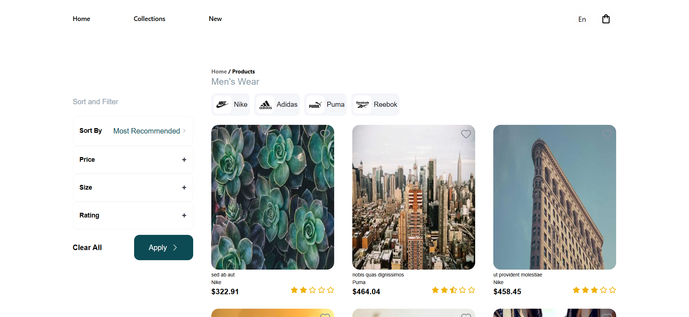
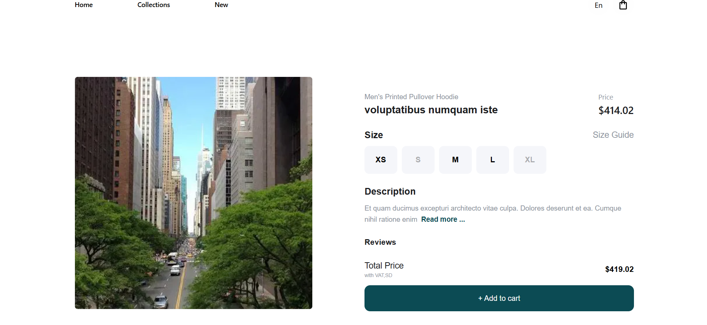

# 🛍️ MyShop - E-commerce Product Listing & Details Page

A fully functional **e-commerce product listing and details page** built as part of the **Mitch Designs Frontend Developer Task**.  
This project focuses on pixel-perfect design implementation, API integration, state management, and clean code architecture using modern web technologies.

---

## 🚀 Tech Stack

- **Framework:** Next.js 16 (App Router)
- **Language:** TypeScript
- **Styling:** Tailwind CSS
- **State Management:** Zustand + React Hooks
- **Data Fetching:** TanStack Query (React Query)
- **HTTP Client:** Fetch API
- **Icons:** Lucide-react
- **Build Tool:** Turbopack (Next.js default)

---


## 🎯 Overview

The project implements:
- Product **listing** and **details** pages
- Full **filtering**, **sorting**, and **pagination**
- Dynamic **language switching (EN/FR)**
- **Loading**, **error**, and **empty** states
- Responsive **pixel-perfect** design following the provided Figma layout

Additionally, I noticed that the API response for /products includes pagination metadata,
so I implemented client-side pagination using Next/Previous buttons that update the query parameters and refetch the products without reloading the page — providing a smoother browsing experience.

---

## ⚙️ Features

### 🛒 Product Listing Page
- Display product cards with image, name, brand, price, and rating.
- Brand filters (Nike, Adidas, Puma, Reebok, All).
- Sorting options (price, rating, newest, etc.).
- Filtering by:
  - Price range  
  - Size (XS–XL)  
  - Rating (2+ to 4+)  
- Pagination with **Next / Previous** buttons.
- Skeleton and spinner loading states.
- Error and empty states for failed requests or no results.

### 📦 Product Details Page
- Large product image and info (name, price, brand, rating, description).
- **Size selector** with disabled unavailable sizes.
- Review section from API.
- “Add to Cart” button (UI only).
- Back navigation to product listing.
- SEO metadata handled via server-side ISR (`generateMetadata`).

### 🌐 Language Switcher
- Implemented **EN/FR toggle** button.
- Note: The Figma design didn’t include space for this,  
  so I added it thoughtfully in the header for usability.

### ⚡ Performance & UX
- Uses **TanStack Query** for caching and revalidation.
- Handles all loading and error states gracefully.
- Smooth transitions and responsive layout using Tailwind.

## 🧱 Project Structure
src/
├─ app/
│ ├─ products/
│ │ ├─ [id]/
│ │ │ └─ page.tsx
│ │ └─ page.tsx
│ ├─ layout.tsx
│ └─ page.tsx
│
├─ components/
│ ├─ ui/
│ ├─ products/
│ └─ filters/
│
├─ lib/
│ ├─ api/
│ └─ types/
│ └─ utils/
│
├─ hooks/
| └─ api/
│
│
└─ public/
| └─ icons/

---

## 🧩 Hooks & API Integration

### Custom Hooks:
- `useGetProducts()` → Fetches all products with filters, sort, and pagination.
- `useGetProduct(id: string, initialProduct: ProductDetail)` → Fetches a single product (uses initial data from ISR).

### Server Functions:
- `getProduct()` → Used in server-side rendering for SEO & `generateMetadata`.

### API Base URL: https://task.woosonicpwa.com/api

---

## 🧠 State Management

Used **Zustand** for lightweight global state (filters, pagination, language).  
This allows clean separation between UI logic and data fetching.

---

## 🖼️ Screenshots

- **Product Listing Page**  
  

- **Product Details Page**  
  

---


## 🧰 How to Run Locally

```bash
# 1️⃣ Clone the repository
git clone https://github.com/Mitchell-Woods/mitch-designs-task.git 
cd myshop

# 2️⃣ Install dependencies
npm install

# 3️⃣ Run development server
npm run dev

# 4️⃣ Open in browser
http://localhost:3000

---
👨‍💻 Author

Mohamed Tarek
📧 mtarekmo21@gmail.com
🔗 GitHub: mohamedtarek45